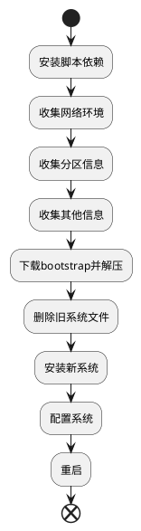

# VPS安装archlinux

## 0. 概述

## 1. 脚本

### 1.1 依赖

初始版本的脚本仅依赖:
* `coreutils`: Linux核心工具，用于收集系统信息
* `gawk`: 用于字符串处理
* `jq`: 解析json
* `curl`: 下载使用
* `tar`,`zstd`: 解包

### 1.2 过程

ChatGPT 4辅助我完成收集当前系统信息的编写，大大减轻我搜索调试成本

### 1.3 脚本

* [bootstrap.bash](https://github.com/echizenryoma/scripts/blob/main/arch/install/bootstrap.bash): 准备bootstrap环境
* [setup.bash](https://github.com/echizenryoma/scripts/blob/main/arch/install/setup.bash): 实际安装系统脚本

## 2. 参考

1. [Arch Linux on a VPS](https://wiki.archlinux.org/title/Arch_Linux_on_a_VPS)
2. [Network configuration](https://wiki.archlinux.org/title/Network_configuration)
