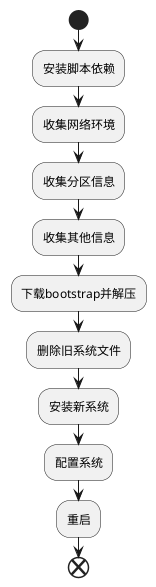

# VPS安装archlinux

## 0. 概述



## 1. 脚本

### 1.1 依赖

初始版本的脚本仅依赖:
* `coreutils`: Linux核心工具，用于收集系统信息
* `gawk`: 用于字符串处理
* `jq`: 解析json
* `curl`: 下载使用
* `tar`,`zstd`: 解包

### 1.2 过程

ChatGPT 4辅助我完成收集当前系统信息的编写，大大减轻我搜索调试成本

### 1.3 成品

* [bootstrap.bash](https://github.com/echizenryoma/scripts/blob/main/arch/install/bootstrap.bash): 准备bootstrap环境
* [setup.bash](https://github.com/echizenryoma/scripts/blob/main/arch/install/setup.bash): 实际安装系统脚本

## 2. 安装环境

### 2.1 bootstrap

```shell
wget "https://mirrors.kernel.org/archlinux/iso/latest/archlinux-bootstrap-x86_64.tar.gz" -O /archlinux-bootstrap-x86_64.tar.gz
mkdir /install
tar xzf /archlinux-bootstrap-x86_64.tar.gz --numeric-owner
```

进入arch提供的`bootstrap`环境
```shell
/install/root.x86_64/bin/arch-chroot /install/root.x86_64/
```


### 2.2 pacman配置

```shell
echo 'Server = https://mirrors.kernel.org/archlinux/$repo/os/$arch' >> /etc/pacman.d/mirrorlist
pacman-key --init
pacman-key --populate
```

### 2.3 挂载目录

```shell
mount /dev/sda1 /mnt
mount /dev/sda15 /mnt/boot/efi
```

### 2.4 备份/etc/fstab

```shell
cp /mnt/etc/fstab /etc/fstab
```

### 2.5 删除原系统

⚠️此操作不可逆
```shell
rm -rf bin boot etc home opt root sbin srv usr var vml* ini* lib* med* snap* *.tar.gz
```

## 3. 安装arch

### 3.1 安装软件包

```shell
pacstrap /mnt base linux-lts linux-firmware nano dhcpcd openssh grub intel-ucode amd-ucode
```

### 3.2 恢复

* 恢复/etc/fstab: `cp /etc/fstab /mnt/etc/fstab`

### 3.3 进入新系统

```shell
arch-chroot /mnt
```

### 3.4 新系统配置

* 设置DNS解析器: `echo 'nameserver 1.1.1.1' >> /etc/resolv.conf`
* 设置默认时区: `ln -sf /usr/share/zoneinfo/Asia/Shanghai /etc/localtime`
* 启用dhcpcd服务: `systemctl enable dhcpcd`
* 启用sshd服务: `systemctl enable sshd`
* 禁用密码登录: `echo "PasswordAuthentication no" >> /etc/ssh/sshd_config`
* 允许root使用私钥登陆: `echo "PermitRootLogin prohibit-password" >> /etc/ssh/sshd_config`
* 设置登陆公钥
* 设置/etc/mkinitcpio.conf: `sed -i "s|^HOOKS=(.*)|HOOKS=(base systemd autodetect modconf kms keyboard block filesystems fsck)|g" /etc/mkinitcpio.conf`
* pacman染色: `sed -i 's|#Color|Color|' /etc/pacman.conf`
* pacman并行下载: `sed -i 's|#ParallelDownloads|ParallelDownloads|' /etc/pacman.conf`

### 3.5 Hyper-V(可选)

* 安装软件包: `pacman -Sy hyperv --noconfirm --needed`
* 设置模块: `sed -i "s|^MODULES=(.*)|MODULES=(hv_storvsc hv_vmbus)|g" /etc/mkinitcpio.conf`
* 启用hv_fcopy_daemon服务(可选): `systemctl enable hv_fcopy_daemon.service`
* 启用hv_kvp_daemon服务(可选): `systemctl enable hv_kvp_daemon.service`
* 启用hv_vss_daemon服务(可选): `systemctl enable hv_vss_daemon.service`


### 3.6 引导器

* 设置串行输出: `sed -i 's|^GRUB_CMDLINE_LINUX_DEFAULT=.*|GRUB_CMDLINE_LINUX_DEFAULT="loglevel=3 rootdelay=300 console=ttyS0 earlyprintk=ttyS0"|g' /etc/default/grub`
* 重新生成initramfs: `mkinitcpio -P`
* 删除fallback镜像: `rm /boot/initramfs-linux-lts-fallback.img`
* 安装grub: `grub-install --target=x86_64-efi --efi-directory=/boot/efi --bootloader-id=arch`
* 生成grub配置: `grub-mkconfig -o /boot/grub/grub.cfg`
* 由于Hyper-V只能通过`/EFI/BOOT/BOOTX64.EFI`引导，所以需要复制引导程序
```shell
mkdir -p /boot/efi/EFI/BOOT
cp /boot/efi/EFI/arch/grubx64.efi /boot/efi/EFI/BOOT/BOOTX64.EFI
```

### 3.7 重启

* 在管理界面重启虚拟机

## 参考

1. [Arch Linux on a VPS](https://wiki.archlinux.org/title/Arch_Linux_on_a_VPS)
2. [Install Arch Linux from existing Linux](https://wiki.archlinux.org/title/Install_Arch_Linux_from_existing_Linux)
3. [Inside Out | Archlinux on Azure](https://codito.in/archlinux-on-azure/)
4. [Arch Linux on a VPS](https://wiki.archlinux.org/title/Arch_Linux_on_a_VPS)
5. [Network configuration](https://wiki.archlinux.org/title/Network_configuration)
