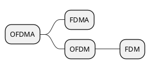

# hostapd

## 0. 概述

### 0.1 概念

#### Wi-Fi与IEEE

| 世代名称 | IEEE标准 | 上市年份 | 频率(GHz) |
| -------- | -------- | -------- | --------- |
| Wi‑Fi 7  | 802.11be | (2024)   | 2.4/5/6   |
| Wi‑Fi 6E | 802.11ax | 2020     | 6         |
| Wi‑Fi 6  | 802.11ax | 2019     | 2.4/5     |
| Wi‑Fi 5  | 802.11ac | 2014     | 5         |
| Wi‑Fi 4  | 802.11n  | 2008     | 2.4/5     |

#### 基本概念

* `MCS`: 调制编码方案(**M**odulation **C**oding **S**cheme)
* `QAM`: 正交幅度调制(**Q**uadrature **A**mplitude **M**odulation)
* `GI`: 防护间隔(**G**uard **I**nterval)
* `Symbol`: 符号
* `空间流数`(Spatial Streams): 发送和接收数据天线数量

#### 物理层协议

| IEEE标准 | 物理层协议 |
| -------- | :--------: |
| 802.11ax |     HE     |
| 802.11ac |    VHT     |
| 802.11n  |     HT     |

#### 复用

* `FDM`: 频分多路复用(**F**requency **D**ivision **M**ultiplexing)
* `OFDM`: 正交频分复用(**O**rthogonal **F**requency **D**ivision **M**ultiplexing)
* `FDMA`: 频分多址(**F**requency **D**ivision **M**ultiple **A**ccess)
* `OFDMA`: 正交频分多址(**O**rthogonal **F**requency **D**ivision **M**ultiple **A**ccess)



| IEEE标准 | 最小子载波频率(kHz) | 20MHz数据子载波数 | 40MHz数据子载波数 | 80MHz数据子载波数 | 160MHz数据子载波数 |
| -------- | :-----------------: | :---------------: | :---------------: | :---------------: | :----------------: |
| 802.11ax |       78.125        |        234        |        468        |        980        |       2x980        |
| 802.11ac |        312.5        |        52         |        108        |        234        |         -          | - |
| 802.11n  |        312.5        |        52         |        108        |         -         |         -          | - |

#### 传输速率

$$
理论传输速率=空间流数\times\frac{1}{符号传输时间+𝐺𝐼}\times符号编码长度\times编码率\times数据子载波数
$$

由于计算过于麻烦，所以一般直接查[调制编码方案表](https://en.wikipedia.org/wiki/Wi-Fi_6#cite_note-17)可以直接得到单空间流的速率。

<table>
<caption><b>调制编码方案</b>
</caption>
<tbody><tr>
<th rowspan="3">MCS<br>index
</th>
<th rowspan="3">Modulation<br>type
</th>
<th rowspan="3">Coding<br>rate
</th>
<th colspan="8">Data rate (Mbit/s)
</th></tr>
<tr>
<th colspan="2">20&nbsp;MHz channels</th>
<th colspan="2">40&nbsp;MHz channels</th>
<th colspan="2">80&nbsp;MHz channels</th>
<th colspan="2">160&nbsp;MHz channels
</th></tr>
<tr>
<th>1600&nbsp;ns GI</th>
<th>800&nbsp;ns GI</th>
<th>1600&nbsp;ns GI</th>
<th>800&nbsp;ns GI</th>
<th>1600&nbsp;ns GI</th>
<th>800 ns GI</th>
<th>1600&nbsp;ns GI</th>
<th>800 ns GI
</th></tr>
<tr>
<td>0</td>
<td>BPSK</td>
<td>1/2</td>
<td>8</td>
<td>8.6</td>
<td>16</td>
<td>17.2</td>
<td>34</td>
<td>36.0</td>
<td>68</td>
<td>72
</td></tr>
<tr>
<td>1</td>
<td>QPSK</td>
<td>1/2</td>
<td>16</td>
<td>17.2</td>
<td>33</td>
<td>34.4</td>
<td>68</td>
<td>72.1</td>
<td>136</td>
<td>144
</td></tr>
<tr>
<td>2</td>
<td>QPSK</td>
<td>3/4</td>
<td>24</td>
<td>25.8</td>
<td>49</td>
<td>51.6</td>
<td>102</td>
<td>108.1</td>
<td>204</td>
<td>216
</td></tr>
<tr>
<td>3</td>
<td>16-QAM</td>
<td>1/2</td>
<td>33</td>
<td>34.4</td>
<td>65</td>
<td>68.8</td>
<td>136</td>
<td>144.1</td>
<td>272</td>
<td>282
</td></tr>
<tr>
<td>4</td>
<td>16-QAM</td>
<td>3/4</td>
<td>49</td>
<td>51.6</td>
<td>98</td>
<td>103.2</td>
<td>204</td>
<td>216.2</td>
<td>408</td>
<td>432
</td></tr>
<tr>
<td>5</td>
<td>64-QAM</td>
<td>2/3</td>
<td>65</td>
<td>68.8</td>
<td>130</td>
<td>137.6</td>
<td>272</td>
<td>288.2</td>
<td>544</td>
<td>576
</td></tr>
<tr>
<td>6</td>
<td>64-QAM</td>
<td>3/4</td>
<td>73</td>
<td>77.4</td>
<td>146</td>
<td>154.9</td>
<td>306</td>
<td>324.4</td>
<td>613</td>
<td>649
</td></tr>
<tr>
<td>7</td>
<td>64-QAM</td>
<td>5/6</td>
<td>81</td>
<td>86.0</td>
<td>163</td>
<td>172.1</td>
<td>340</td>
<td>360.3</td>
<td>681</td>
<td>721
</td></tr>
<tr>
<td>8</td>
<td>256-QAM</td>
<td>3/4</td>
<td>98</td>
<td>103.2</td>
<td>195</td>
<td>206.5</td>
<td>408</td>
<td>432.4</td>
<td>817</td>
<td>865
</td></tr>
<tr>
<td>9</td>
<td>256-QAM</td>
<td>5/6</td>
<td>108</td>
<td>114.7</td>
<td>217</td>
<td>229.4</td>
<td>453</td>
<td>480.4</td>
<td>907</td>
<td>961
</td></tr>
<tr>
<td>10</td>
<td>1024-QAM</td>
<td>3/4</td>
<td>122</td>
<td>129.0</td>
<td>244</td>
<td>258.1</td>
<td>510</td>
<td>540.4</td>
<td>1021</td>
<td>1081
</td></tr>
<tr>
<td>11</td>
<td>1024-QAM</td>
<td>5/6</td>
<td>135</td>
<td>143.4</td>
<td>271</td>
<td>286.8</td>
<td>567</td>
<td>600.5</td>
<td>1134</td>
<td>1201
</td></tr></tbody></table>

### 0.2 常用命令

* `iw phy`: 查看无线网卡详细参数
* `iw dev wlan0 scan`: 无线网卡`wlan0`扫描热点
* `iw wlan0 info`: 查看无线网卡当前运行情况
* `iw reg get`: 获取当前国家码和非授权频率范围
* `iw reg set CN`: 设置当前国家码为`CN`

## 1. 编译

### 1.1 hostapd

由于arch的hostapd并没有启用802.11ax，因此需要自己启用并重新编译

[config](https://github.com/archlinux/svntogit-community/blob/packages/hostapd/trunk/config#L162)修改

```diff
--- config.old
+++ config
@@ -159,7 +159,7 @@
 # Note: This is experimental and work in progress. The definitions are still
 # subject to change and this should not be expected to interoperate with the
 # final IEEE 802.11ax version.
-#CONFIG_IEEE80211AX=y
+CONFIG_IEEE80211AX=y

 # Remove debugging code that is printing out debug messages to stdout.
 # This can be used to reduce the size of the hostapd considerably if debugging
```

### 1.2 驱动

本人使用SparkLAN公司生产的[WNFQ-269AX(BT)](https://www.sparklan.com/product/wnfq-269axbt-wifi6-wifi6e-11ax-triband-m-2-dbdc-module/)Wi-Fi 6E无线网卡

主要规格

| **属性** | **值**                                                         |
| -------- | -------------------------------------------------------------- |
| Wi-Fi    | IEEE 802.11ax/ac/a/b/g/n                                       |
| 蓝牙     | Bluetooth V5.2, V5.1, V5.0, V4.2, V4.1, V4.0LE, V3.0, V2.1+EDR |
| 芯片     | Qualcomm Atheros WCN6856                                       |
| 天线     | 2 x IPEX MHF4                                                  |
| 支持频率 | 2.412\~2.484GHz, 5.150\~5.850GHz, 5.925\~7.125GHz              |
| 支持模式 | 20MHz, 40MHz, 80MHz, 160MHz, 80+80MHz                          |

`linux-firmware`在`20230310`标签之后才支持该网卡，对于之前版本需要自己动手修改[kvalo/ath11k-firmware](https://github.com/kvalo/ath11k-firmware)

```bash
git clone https://github.com/kvalo/ath11k-firmware.git
mkdir WCN6855
cp ath11k-firmware/WCN6855/hw2.0/board-2.bin WCN6855/board-2.bin
cd WCN6855
xz --check=crc32 board-2.bin
sudo cp /lib/firmware/ath11k/WCN6855/hw2.0/board-2.bin.xz /lib/firmware/ath11k/WCN6855/hw2.0/board-2.bin.xz.orig
sudo cp board-2.bin.xz /lib/firmware/ath11k/WCN6855/hw2.0/board-2.bin.xz
sudo modprobe -r ath11k_pci
sudo modprobe ath11k_pci
```

`ifconfig`未找到无线网卡设备，并且`sudo dmesg | grep ath11k`提示`failed to fetch board data`，可能是[kvalo/ath11k-firmware](https://github.com/kvalo/ath11k-firmware)未收录该型号的无线网卡

```shell
$ sudo dmesg | grep ath11k
[ 1843.023186] ath11k_pci 0000:06:00.0: BAR 0: assigned [mem 0xfba00000-0xfbbfffff 64bit]
[ 1843.023513] ath11k_pci 0000:06:00.0: MSI vectors: 32
[ 1843.023517] ath11k_pci 0000:06:00.0: wcn6855 hw2.1
[ 1843.982736] ath11k_pci 0000:06:00.0: chip_id 0x12 chip_family 0xb board_id 0xff soc_id 0x400c1211
[ 1843.982747] ath11k_pci 0000:06:00.0: fw_version 0x11090c35 fw_build_timestamp 2022-04-18 20:23 fw_build_id WLAN.HSP.1.1-03125-QCAHSPSWPL_V1_V2_SILICONZ_LITE-3.6510.9
[ 1844.003923] ath11k_pci 0000:06:00.0: failed to fetch board data for bus=pci,vendor=17cb,device=1103,subsystem-vendor=11ad,subsystem-device=a85d,qmi-chip-id=18,qmi-board-id=255 from ath11k/WCN6855/hw2.1/board-2.bin
[ 1844.003927] ath11k_pci 0000:06:00.0: failed to fetch board.bin from WCN6855/hw2.1
[ 1844.003928] ath11k_pci 0000:06:00.0: qmi failed to fetch board file: -2
[ 1844.003929] ath11k_pci 0000:06:00.0: failed to load board data file: -2
```

需要使用[qca/qca-swiss-army-knife](https://github.com/qca/qca-swiss-army-knife)来编辑board-2.bin

```bash
git clone https://github.com/qca/qca-swiss-army-knife.git
./qca-swiss-army-knife/tools/scripts/ath11k/ath11k-bdencoder -e board-2.bin -o board-2.json
```

找到`board-2.json`中`data`最接近`sudo dmesg | grep ath11k`没能匹配到的设备，例如`bus=pci,vendor=17cb,device=1103,subsystem-vendor=11ad,subsystem-device=a85d,qmi-chip-id=18,qmi-board-id=255`，增加到对应的`name`列表中

`board-2.json`

```json
...
            {
                "names": [
                    "bus=pci,vendor=17cb,device=1103,subsystem-vendor=11ad,subsystem-device=a85d,qmi-chip-id=18,qmi-board-id=255",
                    "[对应的无线网卡设备]",
                ],
                "data": "bus=pci,vendor=17cb,device=1103,subsystem-vendor=11ad,subsystem-device=a85d,qmi-chip-id=18,qmi-board-id=255.bin"
            },
...
```

然后重新打包生成新的`board-2.bin`

```bash
./qca-swiss-army-knife/tools/scripts/ath11k/ath11k-bdencoder -c board-2.json -o board-2.bin
```

### 1.3 注册

```shell
$ iw reg get
global
country CN: DFS-FCC
        (2400 - 2483 @ 40), (N/A, 20), (N/A)
        (5150 - 5350 @ 80), (N/A, 20), (0 ms), DFS, AUTO-BW
        (5725 - 5850 @ 80), (N/A, 33), (N/A)
        (57240 - 59400 @ 2160), (N/A, 28), (N/A)
        (59400 - 63720 @ 2160), (N/A, 44), (N/A)
        (63720 - 65880 @ 2160), (N/A, 28), (N/A)

phy#0 (self-managed)
country CN: DFS-FCC
        (2402 - 2482 @ 40), (N/A, 20), (N/A)
        (5170 - 5250 @ 80), (N/A, 23), (N/A), AUTO-BW
        (5250 - 5330 @ 80), (N/A, 23), (0 ms), DFS, AUTO-BW
        (5735 - 5835 @ 80), (N/A, 33), (N/A), AUTO-BW
```

* 全局设置(`global`)的国家码可以通过修改`/etc/conf.d/wireless-regdom`，取消相应的国家码注释，重启生效
* 无线网卡设备
  * 使用全局设置: 设置相应的全局配置即可
  * 设备自管理(`self-managed`): 这个需要主动扫描热点，设备会根据热点自动注册

```bash
#!/bin/bash

echo "ip link set wlan0 up"
ip link set wlan0 up

phy=$(iw dev wlan0 info | grep wiphy | awk '{print "phy"$2}')

for i in {1..16}
do
  country=$(iw phy $phy reg get | grep country | awk '{print $2}' | tr -d ':')
  if [[ "$country" != "00" ]]
  then
    echo "find iw reg $country"
    sed -i "s|^country_code=.*|country_code=$country|" /etc/hostapd/hostapd.conf
    exit 0
  fi
  echo "iw dev wlan0 scan"
  iw dev wlan0 scan > /dev/null
done

echo "not found country"
exit 1

```

## 2. 配置

### 2.1 参考配置

```ini
interface=wlan0
bridge=br-lan
driver=nl80211

ssid=[热点名]
utf8_ssid=1
hw_mode=a
channel=36
preamble=1

ieee80211w=1
wpa=2
wpa_passphrase=[密码]
wpa_key_mgmt=WPA-PSK SAE
wpa_pairwise=CCMP CCMP-256

ieee80211h=1

ieee80211d=1
country_code=CN

ieee80211n=1
wmm_enabled=1
ht_capab=[LDPC][HT40+][SHORT-GI-20][SHORT-GI-40][TX-STBC][RX-STBC1][MAX-AMSDU-7935][DSSS_CCK-40]

ieee80211ac=1
vht_capab=[MAX-MPDU-11454][RXLDPC][VHT160][SHORT-GI-80][SHORT-GI-160][TX-STBC-2BY1][RX-STBC-1][SU-BEAMFORMER][SU-BEAMFORMEE][MAX-A-MPDU-LEN-EXP3]
vht_oper_chwidth=2
vht_oper_centr_freq_seg0_idx=50

ieee80211ax=1
he_su_beamformer=1
he_su_beamformee=1
he_mu_beamformer=1
he_bss_color=8
he_oper_chwidth=2
he_oper_centr_freq_seg0_idx=50
```

### 2.2 配置解析

* interface: 无线网卡设备名
* bridge: 绑定的网桥设备名(可选)
* driver: 使用的驱动
  * hostap
  * nl80211
* ssid: Wi-Fi热点名称
* utf8_ssid: Wi-Fi热点名称使用UTF-8编码(可选)
* hw_mode: 硬件工作模式
  * a = IEEE 802.11a (5 GHz)
  * b = IEEE 802.11b (2.4 GHz)
  * g = IEEE 802.11g (2.4 GHz)
  * ad = IEEE 802.11ad (60 GHz)
* channel: 信道号
* ieee80211w: 无线网络管理帧的保护
* wpa: WPA版本，注意WPA3这里也是设置为2
* wpa_passphrase: WPA密码
* wpa_key_mgmt: 推荐WPA-PSK(WPA2-Personal)和SAE(WPA3-Personal)
* wpa_pairwise: 推荐CCMP，废弃TKIP
* ieee80211h: 为了符合电波管制的要求，IEEE 802.11h定义了两种服务：传输功率控制和动态频率选择，如果需要雷达避让频段必须启用
* ieee80211d: 附加调节域的操作规范，主要是设置国际码
* ieee80211n: IEEE 802.11n支持
* ht_capab: HT特性
* ieee80211ac: IEEE 802.11ac支持
* vht_capab: VHT特性
* vht_oper_chwidth: VHT信道宽度
  * 0 = 20/40 MHz
  * 1 = 80 MHz
  * 2 = 160 MHz
  * 3 = 80+80 MHz
* vht_oper_centr_freq_seg0_idx: 频率0的中心信道号
* vht_oper_centr_freq_seg1_idx: 频率1的中心信道号，仅vht_oper_chwidth=3设置
* ieee80211ax: IEEE 802.11ax支持
* he_su_beamformer: 单用户发送端波束成形
* he_su_beamformee: 单用户接收端波束成形
* he_mu_beamformer: 多用户发送端波束成形
* he_bss_color: BSS着色，减少相同频率的干扰
* he_oper_chwidth: =vht_oper_chwidth
* he_oper_centr_freq_seg0_idx: =vht_oper_chwidth

#### HT特性

```shell
$ iw phy
...
        Band 1:
                Capabilities: 0x19e3
                        RX LDPC
                        HT20/HT40
                        Static SM Power Save
                        RX HT20 SGI
                        RX HT40 SGI
                        TX STBC
                        RX STBC 1-stream
                        Max AMSDU length: 7935 bytes
                        DSSS/CCK HT40
                Maximum RX AMPDU length 65535 bytes (exponent: 0x003)
                Minimum RX AMPDU time spacing: No restriction (0x00)
                HT TX/RX MCS rate indexes supported: 0-15
...
```
* [LDPC]
* [HT40-]/[HT40+]
* [SHORT-GI-20]
* [SHORT-GI-40]
* [TX-STBC]
* [RX-STBC1]
* [MAX-AMSDU-7935]
* [DSSS_CCK-40]

#### VHT特性

```shell
$ iw phy
...
        Band 2:
...
                Maximum RX AMPDU length 65535 bytes (exponent: 0x003)
                Minimum RX AMPDU time spacing: No restriction (0x00)
                HT TX/RX MCS rate indexes supported: 0-15
                VHT Capabilities (0x339139f6):
                        Max MPDU length: 11454
                        Supported Channel Width: 160 MHz
                        RX LDPC
                        short GI (80 MHz)
                        short GI (160/80+80 MHz)
                        TX STBC
                        SU Beamformer
                        SU Beamformee
                        MU Beamformee
                        RX antenna pattern consistency
                        TX antenna pattern consistency
...
```

* [MAX-A-MPDU-LEN-EXP3]
* [MAX-MPDU-11454]
* [VHT160]
* [RXLDPC]
* [SHORT-GI-80]
* [SHORT-GI-160]
* [TX-STBC-2BY1]
* [SU-BEAMFORMER]
* [SU-BEAMFORMEE]
* [RX-ANTENNA-PATTERN]
* [TX-ANTENNA-PATTERN]

## 3. 参考

1. [hostapd.conf](https://w1.fi/cgit/hostap/plain/hostapd/hostapd.conf)
2. [Wi-Fi 6 - Wikipedia](https://en.wikipedia.org/wiki/Wi-Fi_6)
3. [Getting WiFi to work on a Razer Blade 14 (2022) - Daniel Perez](https://daniel.perez.sh/blog/2022/blade14-wifi/)
4. [beacon帧字段结构最全总结（二）——HT字段总结 - fengf233 - 博客园](https://www.cnblogs.com/fengf233/p/10919436.html)
5. [beacon帧字段结构最全总结（三）——VHT字段总结 - fengf233 - 博客园](https://www.cnblogs.com/fengf233/p/10919436.html)
