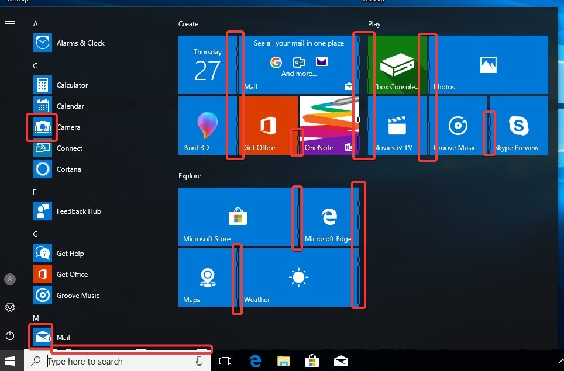

# VMware Worksation

## Windows虚拟机

### 1. 图像渲染问题

#### 问题

表现为随机的撕裂，周期卡死的情况

#### 解决方案

修改vmx文件，将`mks.enableDX12Presentation=FALSE` 添加到 vmx 配置文件中

#### 参考

1. [Windows 11 Guest freezes in Workstation 17.6](https://community.broadcom.com/vmware-cloud-foundation/question/windows-11-guest-freezes-in-workstation-176)
2. [Anyone experiencing strange graphical issues in VMware? 🥴](https://www.threads.net/@thebobpony/post/DGkaB0UONzD/anyone-experiencing-strange-graphical-issues-in-vmware-)
